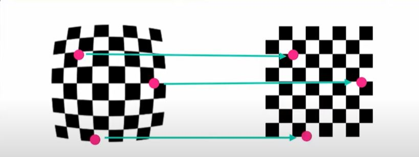
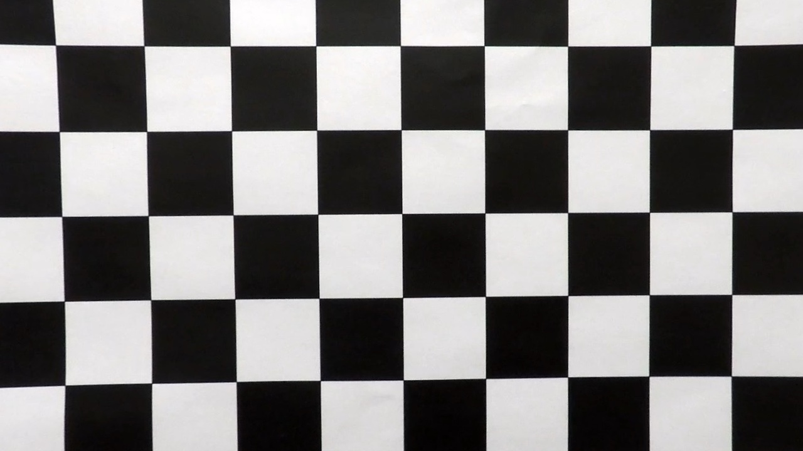
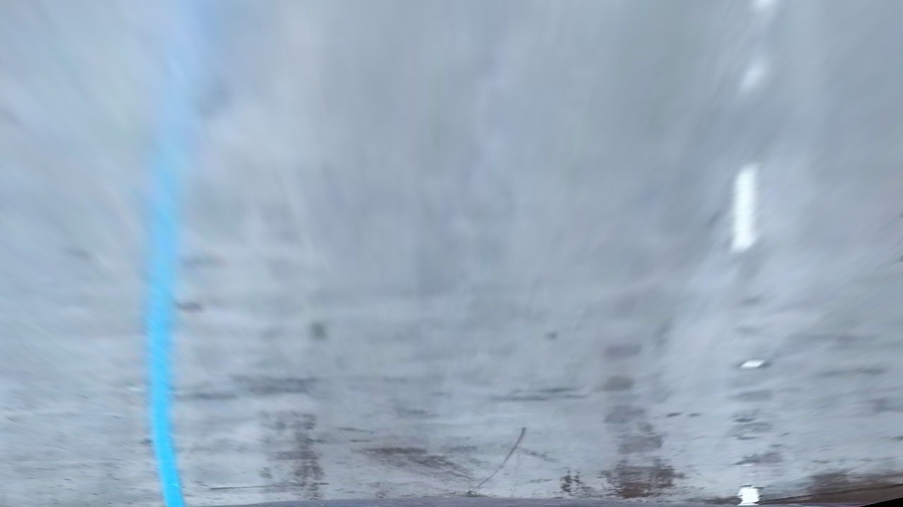
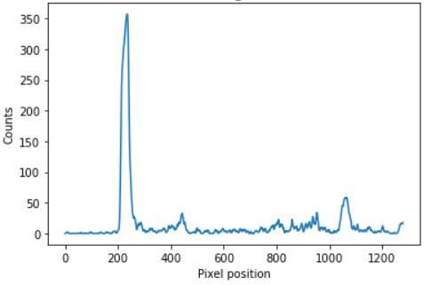
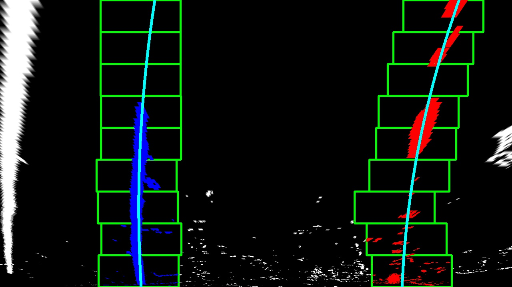
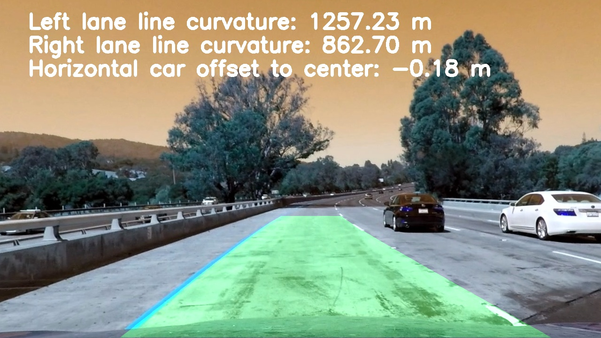

# Advanced Lane Finding Project

---


The goals / steps of this project are the following:

* Compute the camera calibration matrix and distortion coefficients given a set of chessboard images.
* Apply a distortion correction to raw images.
* Use color transforms, gradients, etc., to create a thresholded binary image.
* Apply a perspective transform to rectify binary image ("birds-eye view").
* Detect lane pixels and fit to find the lane boundary.
* Determine the curvature of the lane and vehicle position with respect to center.
* Warp the detected lane boundaries back onto the original image.
* Output visual display of the lane boundaries and numerical estimation of lane curvature and vehicle position.

[//]: # (Image References)

[image1]: ./examples/undistort_output.png "Undistorted"
[image2]: ./test_images/test1.jpg "Road Transformed"
[image3]: ./examples/binary_combo_example.jpg "Binary Example"
[image4]: ./examples/warped_straight_lines.jpg "Warp Example"
[image5]: ./examples/color_fit_lines.jpg "Fit Visual"
[image6]: ./examples/example_output.jpg "Output"
[video1]: ./project_video.mp4 "Video"

[](http://www.udacity.com/drive)


---

## Camera Calibration

### 1. Computed of the camera matrix and distortion coefficients. 

I start by preparing "object points", which will be the (x, y, z) coordinates of the chessboard corners in the world. Here I am assuming the chessboard is fixed on the (x, y) plane at z=0, such that the object points are the same for each calibration image.  Thus, `objp` is just a replicated array of coordinates, and `objpoints` will be appended with a copy of it every time I successfully detect all chessboard corners in a test image.  `imgpoints` will be appended with the (x, y) pixel position of each of the corners in the image plane with each successful chessboard detection.  

I then used the output `objpoints` and `imgpoints` to compute the camera calibration and distortion coefficients using the `cv2.calibrateCamera()` function.  I applied this distortion correction to the test image using the `cv2.undistort()` function and obtained this result: 

<br>
<br>

<center>Example of the output image of the results.</center>

    

<br>

![alt text][image1]
    
<br>


## Pipeline (single images)

### 1. Distortion-corrected image.

To demonstrate this step, I will describe how I apply the distortion correction to one of the test images like this one:
<br>

#### Introduction

**Distortion**

Image distortion occurs when a camera looks at 3D objects in the real world and transforms them into a 2D image; this transformation isn’t perfect. Distortion actually changes what the shape and size of these 3D objects appear to be. So, the first step in analyzing camera images, is to undo this distortion so that you can get correct and useful information out of them.
<br>

![alt text][image2]

<br>
<br>

**It is important to correct image distortion because**:


- Distortion can change the apparent size of an object in an image.

- Distortion can change the apparent shape of an object in an image.

- Distortion can cause an object's appearance to change depending on where it is in the field of view.

- Distortion can make objects appear closer or farther away than they actually are.


**Types of Distortion**

Real cameras use curved lenses to form an image, and light rays often bend a little too much or too little at the edges of these lenses. This creates an effect that distorts the edges of images, so that lines or objects appear more or less curved than they actually are. This is called radial distortion, and it’s the most common type of distortion.

Another type of distortion, is tangential distortion. This occurs when a camera’s lens is not aligned perfectly parallel to the imaging plane, where the camera film or sensor is. This makes an image look tilted so that some objects appear farther away or closer than they actually are.


<br>


For this project, we will use a chessboard. Let's create a transformation that maps these distorted points to undistorted points.

<br>

<center>Map distorted points to undistorted points</center>

<br>    




<br>

### Steps we will take to calibrate the camera.

- Finding Corners
- Calibating Camera


#### Finding Corners


>I used the OpenCV functions [**findChessboardCorners()**](https://docs.opencv.org/2.4/modules/calib3d/doc/camera_calibration_and_3d_reconstruction.html#cv2.findChessboardCorners) and [**drawChessboardCorners()**](https://docs.opencv.org/2.4/modules/calib3d/doc/camera_calibration_and_3d_reconstruction.html#cv2.drawChessboardCorners) to automatically find and draw corners in an image of a chessboard pattern.

<br>

<br>

<center>Corners_found_calibration2.jpg</center>

<br>


<br>
<br>

<center>Corners_found_calibration3.jpg</center>

<br>

<br>
<br>

<center>Corners_found_calibration6.jpg</center>

<br>


<br>

#### Calibating Camera

>
>First, a Conversion of an image, imported by cv2 or the glob API, is made to grayscale:

>- gray = cv2.cvtColor(img,cv2.COLOR_BGR2GRAY)


>**Note**: If you are reading in an image using mpimg.imread() this will read in an RGB image and you should convert to grayscale using cv2.COLOR_RGB2GRAY, but if you are using cv2.imread() or the glob API, as happens in this video example, this will read in a BGR image and you should convert to grayscale using cv2.COLOR_BGR2GRAY. We'll learn more about color conversions later on in this lesson, but please keep this in mind as you write your own code and look at code examples.

>Finding chessboard corners (for an 9x6 board):

>- ret, corners = cv2.findChessboardCorners(gray, (9,6), None)

>Drawing detected corners on an image:

>- img = cv2.drawChessboardCorners(img, (9,6), corners, ret)

>Camera calibration, given object points, image points, and the shape of the grayscale image:

>- ret, mtx, dist, rvecs, tvecs = cv2.calibrateCamera(objpoints, imgpoints, gray.shape[::-1], None, None)

>Undistorting a test image:

>- dst = cv2.undistort(img, mtx, dist, None, mtx) 


<br>

<center>Original image</center>

<br>    


<br>


<br>

<center>Actual output image</center>

<br>    




<br>
<br>

### 2. Color transforms, gradients to create a thresholded binary image.  

I used a combination of color and gradient thresholds to generate a binary image (thresholding steps at lines **cv2.Sobel(), abs_sobelx = np.absolute(sobelx) and scaled_sobel = np.uint8(255*abs_sobelx/np.max(abs_sobelx))** through the function **abs_sobel_thresh()** with parameters **sobel_kernel=3**, **thresh=(25, 75)** ).  Here's an example of my output for this step.  (note: this is not actually from one of the test images)

<br>
<br>

<center>Exmple output image binary</center>
<br>

![alt text][image3]

<br>
<br>
<br>

<center>Actual output image binary</center>
<br>
   


<br>


### 3. Perspective transform and  transformed image.

The code for my perspective transform includes a function called `warper()`, which appears in **Step 4: Perspective 
Transform** file `Advanced Lane Finding`. The `warper()` function takes as inputs an image (`img`), as well as source (`src`) and destination (`dst`) points.  I chose the hardcode the source and destination points in the following manner:


Define perspective transform function

- def warp(img, src_coordinates=None, dst_coordinates=None): 

Define calibration box in source (original) and destination (desired or warped) coordinates

- img_size = (img.shape[1], img.shape[0])


Source and destination Points

```python
src = np.float32(
    [[(img_size[0] / 2) - 55, img_size[1] / 2 + 100],
    [((img_size[0] / 6) - 10), img_size[1]],
    [(img_size[0] * 5 / 6) + 60, img_size[1]],
    [(img_size[0] / 2 + 55), img_size[1] / 2 + 100]])
dst = np.float32(
    [[(img_size[0] / 4), 0],
    [(img_size[0] / 4), img_size[1]],
    [(img_size[0] * 3 / 4), img_size[1]],
    [(img_size[0] * 3 / 4), 0]])
```

This resulted in the following source and destination points:

| Source        | Destination   | 
|:-------------:|:-------------:| 
| 585, 460      | 320, 0        | 
| 203, 720      | 320, 720      |
| 1127, 720     | 960, 720      |
| 695, 460      | 960, 0        |


I verified that my perspective transform was working as expected by drawing the `src` and `dst` points onto a test image and its warped counterpart to verify that the lines appear parallel in the warped image.

![alt text][image4]

### 4. Identified lane-line pixels and fit their positions with a polynomial


After applying calibration, thresholding, and a perspective transform to a road image, you should have a binary image where the lane lines stand out clearly. However, you still need to decide explicitly which pixels are part of the lines and which belong to the left line and which belong to the right line.

Plotting a histogram of where the binary activations occur across the image is one potential solution for this.


With this histogram we are adding up the pixel values along each column in the image. In our thresholded binary image, pixels are either 0 or 1, so the two most prominent peaks in this histogram will be good indicators of the x-position of the base of the lane lines. We can use that as a starting point for where to search for the lines. From that point, we can use a sliding window, placed around the line centers, to find and follow the lines up to the top of the frame.

<br>

<center>Prespective transform image</center>
<br>
   



<br>

<center>Histogram</center>
<br>
   



<br>
<br>

### Implement Sliding Windows and Fit a Polynomial

The two highest peaks in our histogram are the starting point to determine where the lane lines are, and then sliding windows that move up in the image were used to determine where the lane lines go.

<br>

<center>Sliding windows out_img</center>
<br>
   



<br>

<br>

<center>Measuring Curvature</center>
<br>

![alt text][image5]

<br>

### Implementing the Calculation

- Generate some fake data to represent lane-line pixels

- For each y position generate random x position within +/-50 pix of the line base position in each case (x=200 for left, and x=900 for right)

- Fit a second order polynomial to pixel positions in each fake lane line

- Plot up the fake data

<br>

<center>Implementing the Calculation</center>
<br>


<br>


### 5. Calculated the radius of curvature of the lane and the position of the vehicle with respect to center.

This involves measuring how long and wide the section of lane is that we're projecting in our warped image. We could do this in detail by measuring out the physical lane in the field of view of the camera, but for this project, you can assume that if you're projecting a section of lane similar to the images above, the lane is about 30 meters long and 3.7 meters wide. Or, if you prefer to derive a conversion from pixel space to world space in your own images, compare your images with U.S. regulations that require a minimum lane width of 12 feet or 3.7 meters, and the dashed lane lines are 10 feet or 3 meters long each.

<br>
<center>left_curverad: 533.7525889210925 m</center>
<br>
<center>right_curverad: 648.1574851434334 m</center>


### 6. Provide an example image of your result plotted back down onto the road such that the lane area is identified clearly.

Once you have a good measurement of the line positions in warped space, it's time to project your measurement back down onto the road! Let's suppose, as in the previous example, you have a warped binary image called warped, and you have fit the lines with a polynomial and have arrays called ploty, left_fitx and right_fitx, which represent the x and y pixel values of the lines. 

<br>

<center>Imagen Example</center>

![alt text][image6]

<br>

<center>Imagen Output</center>
<br>


<br>


---

### Pipeline (video)

### 1. Pipeline final and video output.  

The development of the project was following these steps:

1. - Camera Calibration
2. - Distortion Correction
3. - Color & Gradient Treshold
4. - Perspective Transform
5. - Detect Lane Lines
6. - Determine the Lane Curvature

The result of following these steps is shown in the following video.


Here's a [Finding Lane Lines Solid White Right Lines](https://youtu.be/3dgbT-PgoNw)

---


### Discussion

The algorithm generally detects the lines and shows a fairly acceptable fill in the region of interest. However, it still has some flaws in achieving better precision in some areas.
It does not manage to detect small sections within the region of interest showing cuts in the fill inside the polygon; also, while the video advances, there are parts where the fill extends very little in the upper part of the polygon. When implemented in other test videos, the algorithm does not achieve the robustness necessary to detect the polygon's lane lines.
